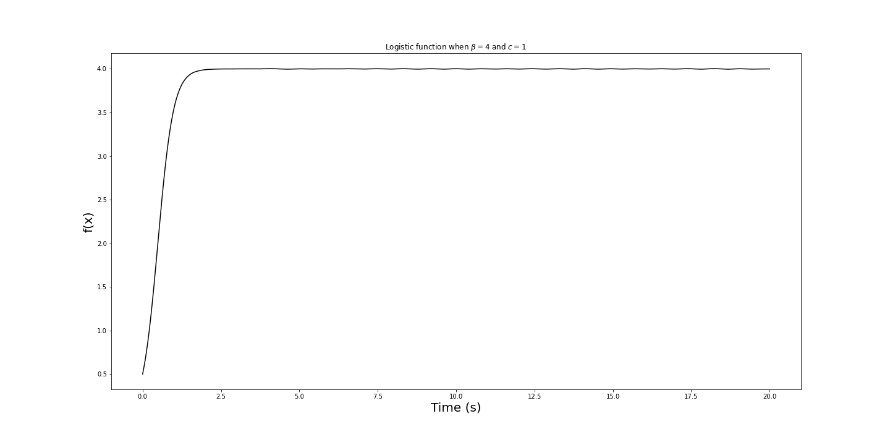

# Analyzing Ikeda Map using Cobweb and Bifurcation diagram.
Computational Physics Final Project (Fall 2022, PHY391C)

Authors : Inhwan Kim, Casey Christian, Adam Christensen


## Setup

1. Download the repository
`https://github.com/ihkim94/ikeda.git`

2. Download the required packages, numpy, matplotlib, and scipy. If you are using conda, you can download them on your_env_name as,

```
conda activate your_env_name

conda install numpy matplotlib scipy

conda activate your_env_name
```

3. You also have to install ddeint to solve the delay differential equation at [here](https://github.com/Zulko/ddeint).


## Examples

0. Open the main.ipynb file. Run the first shell of the script.

1. Plotting the function of the logistic equation.

```python
logistic_model = LogisticEquation(b=4, c=1)
ic = [0.5]  ## Initial condition
tpts, sol = logistic_model.solve(ic, 0, 20, 10000)


plt.figure(figsize=(20, 10))
plt.title(rf'Logistic function when $\beta = {logistic_model.b}$ and $ c = {logistic_model.c}$ ')
plt.xlabel('Time (s)', fontsize=20)
plt.ylabel('f(x)', fontsize=20)
plt.plot(tpts, sol, color='k')
```



2. 


