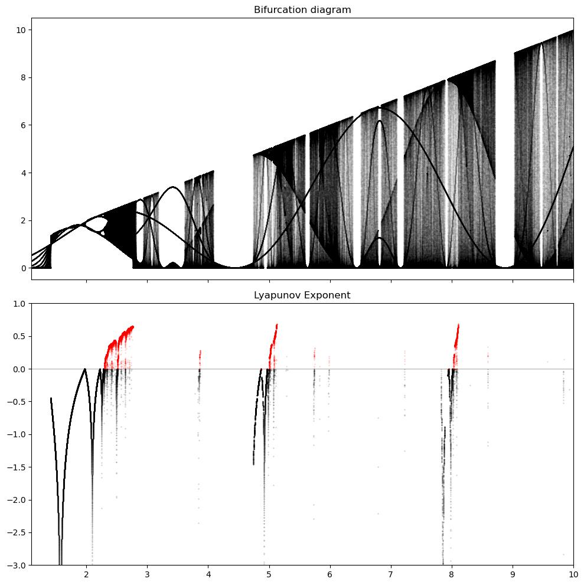

# Analyzing Ikeda Map using Cobweb (Spiderweb) and Bifurcation diagram.

Computational Physics Final Project (Fall 2022, PHY391C)

Authors : Inhwan Kim, Casey Christian, Adam Christensen


## Setup

1. Download the repository
`https://github.com/ihkim94/ikeda.git`

2. Download the required packages, numpy, matplotlib, and scipy. If you are using conda, you can download them on your_env_name as,

```
conda activate your_env_name

conda install numpy matplotlib scipy  

conda activate your_env_name
```

3. You also have to install ddeint to solve the delay differential equation at [here](https://github.com/Zulko/ddeint).


## Examples

0. Open the main.ipynb file. Run the first shell of the script.

1. Plotting the function of the logistic equation.

```python
logistic_model = LogisticEquation(b=4, c=1)
ic = [0.5]  ## Initial condition
tpts, sol = logistic_model.solve(ic, 0, 20, 10000)


plt.figure(figsize=(20, 10))
plt.title(rf'Logistic function when $\beta = {logistic_model.b}$ and $ c = {logistic_model.c}$ ')
plt.xlabel('Time (s)', fontsize=20)
plt.ylabel('f(x)', fontsize=20)
plt.plot(tpts, sol, color='k')
```


2. Plotting the function of the ikeda equation using ddeint package.

```python
ic = 2.4 ## initial condition
delay = 1 ## delay time
beta = 8 ## intensity of nonlinear function
tau = 0.08  ## the system always has a response time

def values_before_zero(t):
    return ic

def model(y, t):
    return (beta/tau)*(np.sin(y(t - delay))**2) - y(t)/tau

def solve(t_min, t_max, nt):
    tpts = np.linspace(t_min, t_max, nt)
    sol = ddeint(model, values_before_zero, tpts)
    return tpts, sol

tpts, sol = solve(0, 20, 10000) ## time input

plt.figure(figsize=(10, 5))
plt.title(rf'Ikeda function when $\beta = {beta}$ and $\tau_R={delay}$ and $\tau={tau}$')
plt.xlabel('Time (s)', fontsize=20)
plt.ylabel('f(x)', fontsize=20)
plt.plot(tpts, sol, color='k')
```
 

3. Plotting the cobweb diagram for the logistic map.
4. 
```python
logistic_model = spiderweb(n = 1000)
logistic_model.plot_logistic(r = 3, ic = 0.5)
```


4. Plotting the cobweb diagram for the adiabatic ikeda map.

```python
ikeda_adiabatic_model = spiderweb(n = 100)
ikeda_adiabatic_model.plot_adiabatic_ikeda(b = 20, ic = 5, t_min = 0, t_max = 20, tn = 10000)
```


5. Plotting the bifurcation for the logistic map.

```python
model = analysis(1.1, 4, 3000, 5000)
model.logistic_plot(1999, 0.6)
```


6. Plotting the bifurcation diagram for the adiabatic ikdea map.

```python
model = analysis(1.1, 10, 200000, 5000)
model.ikeda_adiabatic_plot(n_sol_show = 4999, ic = 1)
```



## Reference

* Ikeda-based nonlinear delayed dynamics for application to secure optical transmission systems using chaos, L. Larger, C.R. Physique 5 (2004)
* Using Synchronization for Prediction of High-Dimensional Chaotic Dynamics, R. Roy et al., Phys. Rev. Lett. 101, 154102 (2008)
* William Gilpin's lecture note
* Feliciano Guistino's Classical Mechnics lecture note


